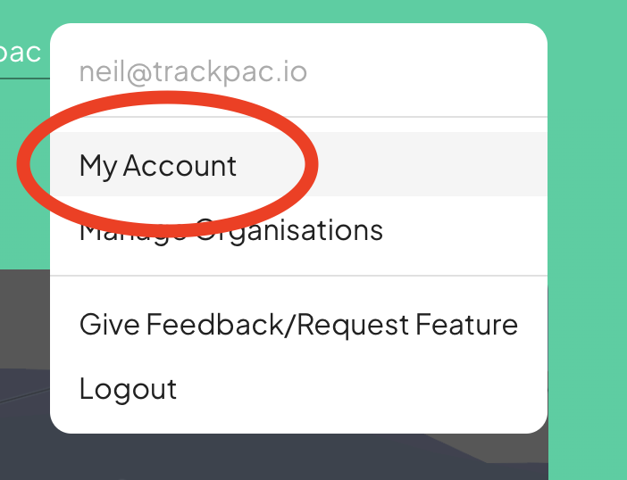
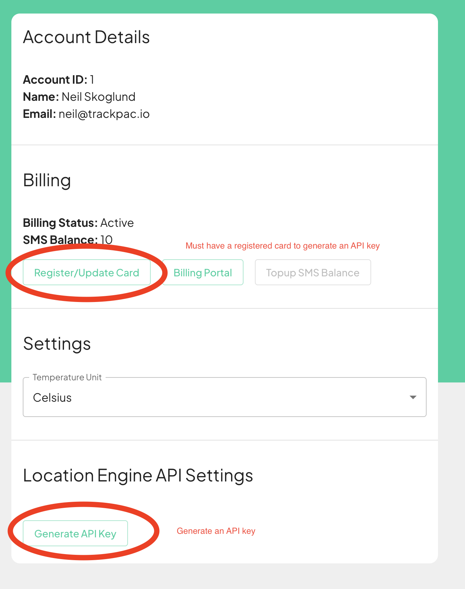

# Location Engine API Resolution

Our Location engine offers two modes of resolution, [LoRaWAN](#lorawan-location-lookup) and [WIFI](#wifi-location-lookup).

To use our location engine services you must first sign up for an account. Sign up here [https://v2.trackpac.io](https://v2.trackpac.io)

One signed up, click your profile icon top right of the menu and generate an API key.




**_*NOTE:*_** You must have billing enabled, and a card registered to generate an API key.



**POSTMAN COLLECTION** You only need to change the parms API key and replace the body on your chosen location lookup route.

<a href="/trackpac-location-engine-postman.json" target="_BLANK" download>Download Location Engine Postman Collection</a>

## LoRaWAN Location Lookup

For our location engine to resolve a location it needs a list of hotspots that heard the uplink, location of the hotspot and what signal strength it heard the uplink at.

**_Note:_** any hotspots with blank locations will be filtered.

A typical payload looks like:

```
{
    "hotspots": [
        {
            "lat": 52.23153880933455,
            "long": -1.7309963563346425,
            "rssi": -113.0,
        },
        {
            "lat": 52.23153880933455,
            "long": -1.7309963563346425,
            "rssi": -113.0,
        },
        {
            "lat": 52.23153880933455,
            "long": -1.7309963563346425,
            "rssi": -113.0,
        },
    ]
}
```

Users can then post a lookup to:

```
https://v2-api.trackpac.io/location-engine/resolve?api_key=XYZ
```

**_Example Result_**

```
{
    latitude: 0.0000
    longitude: 0.0000
    geocode: "xyz street, xyz location",
}
```

## Wifi Location Lookup

If your device supports sniffing WIFI , you can use our services to resolve location.

**_Example Payload_**

```
{
    "networks": [
        {
            "bssid": "FF:FF:FF:FF:FF:FF",
            "rssi": -90
        },
        {
            "bssid": "FF:FF:FF:FF:FF:FA",
            "rssi": -92
        }
    ]
}
```

Users can then post a lookup to:

```
https://v2-api.trackpac.io/location-engine/resolve/wifi?api_key=XYZ
```

**_Example Result_**

```
{
    latitude: 0.0000
    longitude: 0.0000
    geocode: "xyz street, xyz location",
}
```
