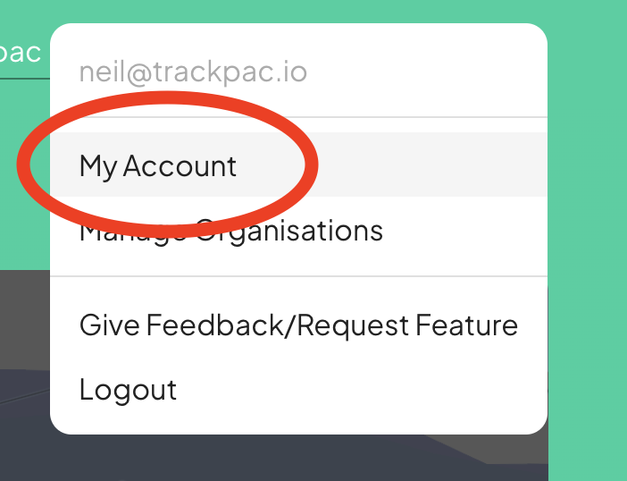
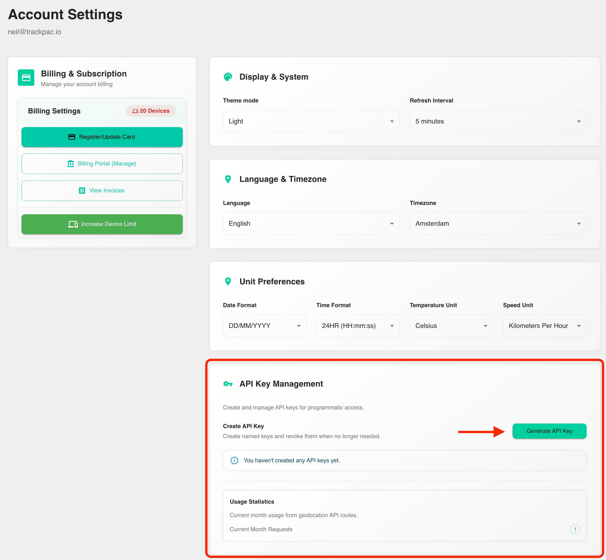
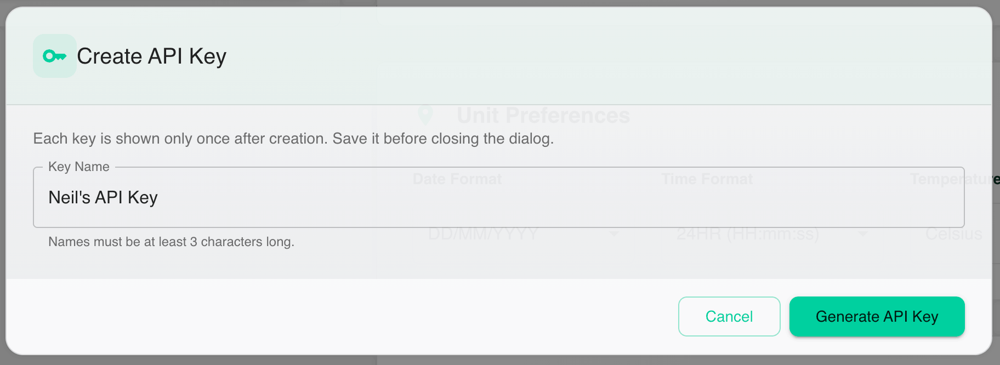
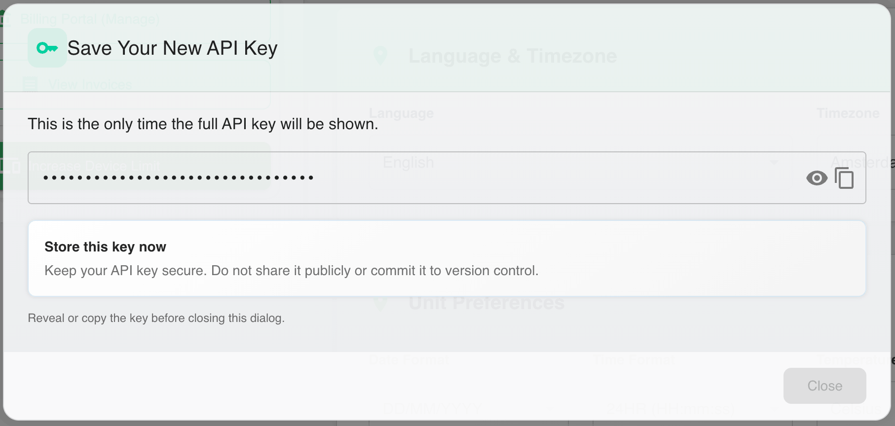

# Location Engine API Resolution

Our Location engine offers two modes of resolution, [LoRaWAN](#lorawan-location-lookup) and [WIFI](#wifi-location-lookup).

To use our location engine services you must first create an account at [https://app.trackpac.io](https://app.trackpac.io).

After signing in, open your account page at [https://app.trackpac.io/account](https://app.trackpac.io/account) and generate an API key.




**_*NOTE:*_** You must have billing enabled, and a card registered to generate an API key.







Give the key a friendly name of at least 3 characters, copy it when shown, and store it securely. API keys are only shown once and can be revoked later from the same account page.

**POSTMAN COLLECTION** Add your API key to the `X-API-Key` header and replace the request body on your chosen location lookup route.

<a href="/trackpac-location-engine-postman.json" target="_BLANK" download>Download Location Engine Postman Collection</a>

## LoRaWAN Location Lookup

For our location engine to resolve a location it needs a list of hotspots that heard the uplink, location of the hotspot and what signal strength it heard the uplink at.

**_Note:_** any hotspots with blank locations will be filtered.

A typical payload looks like:

```
{
    "hotspots": [
        {
            "lat": 52.23153880933455,
            "long": -1.7309963563346425,
            "rssi": -113.0,
        },
        {
            "lat": 52.23153880933455,
            "long": -1.7309963563346425,
            "rssi": -113.0,
        },
        {
            "lat": 52.23153880933455,
            "long": -1.7309963563346425,
            "rssi": -113.0,
        },
    ]
}
```

Users can then post a lookup to:

```bash
curl --request POST \
  --url https://api.trackpac.io/location-engine/resolve \
  --header 'Content-Type: application/json' \
  --header 'X-API-Key: YOUR_API_KEY' \
  --data '{
    "hotspots": [
      {
        "lat": 52.23153880933455,
        "long": -1.7309963563346425,
        "rssi": -113.0
      }
    ]
  }'
```

**_Example Result_**

```
{
    latitude: 0.0000
    longitude: 0.0000
    geocode: "xyz street, xyz location",
}
```

## Wifi Location Lookup

If your device supports sniffing WIFI , you can use our services to resolve location.

**_Example Payload_**

```
{
    "networks": [
        {
            "bssid": "FF:FF:FF:FF:FF:FF",
            "rssi": -90
        },
        {
            "bssid": "FF:FF:FF:FF:FF:FA",
            "rssi": -92
        }
    ]
}
```

Users can then post a lookup to:

```bash
curl --request POST \
  --url https://api.trackpac.io/location-engine/resolve/wifi \
  --header 'Content-Type: application/json' \
  --header 'X-API-Key: YOUR_API_KEY' \
  --data '{
    "networks": [
      {
        "bssid": "FF:FF:FF:FF:FF:FF",
        "rssi": -90
      },
      {
        "bssid": "FF:FF:FF:FF:FF:FA",
        "rssi": -92
      }
    ]
  }'
```

**_Example Result_**

```
{
    latitude: 0.0000
    longitude: 0.0000
    geocode: "xyz street, xyz location",
}
```
