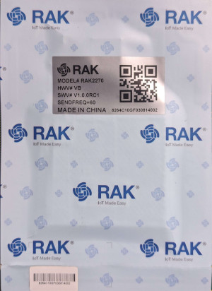
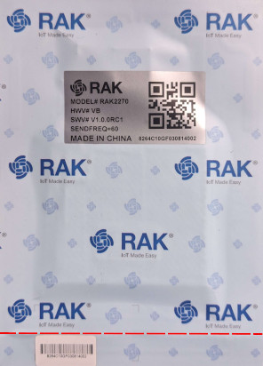

# RAKWireless RAK2270

Congratulations on your purchase of the RAK2270 Sticker Tracker powered by Trackpac!

Follow this step-by-step guide to get your stickers working.

### Unpack Your Device

1. **Remove the Protective Covering**: The RAK2270's come enclosed in a protective bag, take them out, whilst this wont effect the quality we dont reccomend putting them back in when active.

2. **Locate the QR Code**: The QR Code is used for pairing the device with your account on our platform. It is located on the silver sticker at the top.

### Access the Trackpac Portal

Navigate to [https://v2.trackpac.io](https://v2.trackpac.io) — your central platform for device management.

---

### Create or Log in to Your Trackpac Account

- **First-time User**: Use social logins or sign up with a username and password.

---

### Add Your Device

1. **Locate Add Device Button**: Look for the "+" button to add a new device and click it.

2. You will then be presented with the following options, select **Scan QR Code**

3. Scan the RAK2270 QR Code, the scanner will alert you when it has read the QR code successfully.

4. **Confirm**: Post-scan, your device will show up in the dashboard.

> **Trouble?** Use the live chat at the bottom right corner for instant help.

---

### Activate Your Device

- **Rip to Activate**: Gently rip the perforated tab at the sticker's bottom to activate and power up the device.

---

### Monitor Your Device

- **Wait for Data**: The device checks in every 60 minutes. You'll start to see data an hour post-activation.

---

### Updating the Uplink Rate

- **Send a commad**: View the device on your Trackpac portal, click the cog item and then **Send Command**

- The port should be set to 1.

- Here are a few common commands for different rates:

  - 5 minutes: AgAF
  - 10 minutes: AgAK
  - 15 minutes: AgAP
  - 20 minutes: AgAU
  - 30 minutes: AgAe
  - 1 hour: AgA8
  - 2 hours: AgB4
  - 6 hours: AgFo
  - 12 hours: AgLQ
  - 24 hours: AgWg

### Next Steps

- **[Add a Contact](../getting-started/add-a-contact)** - Setup contacts to get notifications
- **[Add a Geofence](../getting-started/add-a-geofence)** - Get notifications when a tag enters or exits an area
- **[Add an Action](../getting-started/add-an-action)** - Setup alerts for temperature warnings

---

### Additional Resources

- **Bulk Onboarding**: For large volumes, contact us for dedicated support.
- **Feedback**: We value your feedback. Click [here](https://trackpac.canny.io/feature-device-requests) to share your experience.
- **Support**: Prefer an email? Contact us at [support@trackpac.io](mailto:hello@trackpac.io)

---

Thank you for choosing Trackpac. We're here to assist you every step of the way.
