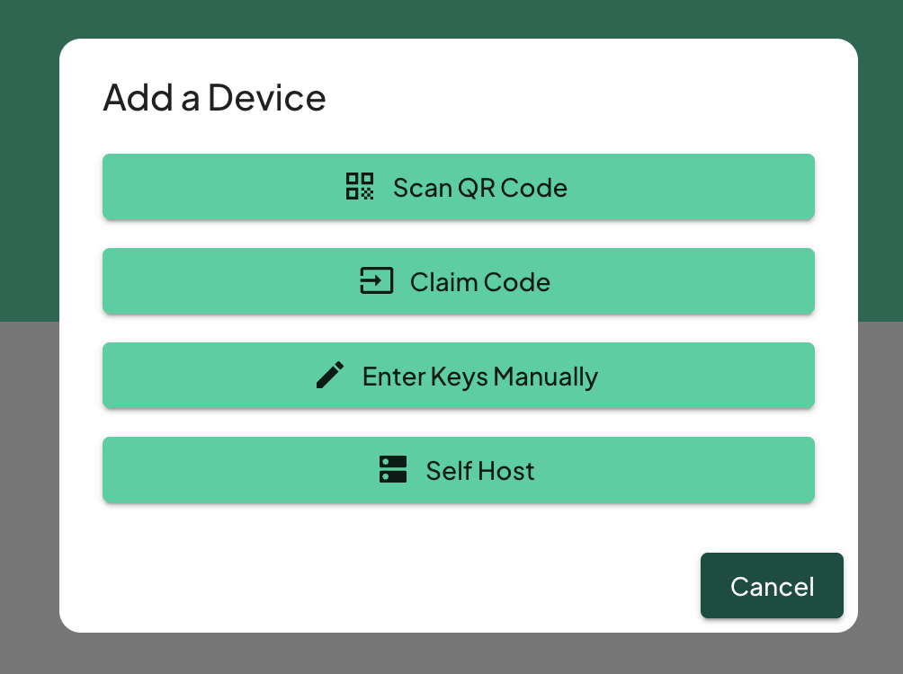

# SenseCAP T1000

Getting started with your SenseCAP T1000 and Trackpac couldnt be easier. Follow our step-by-step guide below to get started

## Create or Log in to Your Trackpac Account

- **First-time User**: Login to our portal at: [https://v2.trackpac.io](https://v2.trackpac.io). You can use Social logins to login or sign up with a username and password.

---

## Add Your Device

If you purchased a Trackpac enabled T1000, you will be able to add the device via QR code. otherwise you can either add the keys manually, or self host and forward us the devices data.

\*\* if you purchased your T1000 directly or via kickstarter, we will need to generate new keys for your T1000 and set them. Get in touch for help.

**Click Add Device'**: Go to the "Devices" tab and click on + Icon top right.

You will then be presented with options as shown below

**_Scan QR Code_**

Scan the QR code on the back of your Browan Tab Object Locator. The dialog will let you know when the QR code has been scanned successfully

**_Claim Code_**

Use this option if you dont have a camera handy to scan the qr, enter the code manually. In the designated field, type the claim code that came with your device.

**_Enter Keys Manually_**

This option hosts the device on Trackpac's LNS. you will need the dev_eui, app_eui and app_key to choose this option. Manually enter the device's keys and then select which device type.

**_Self Host_**

If you wish to host the device yourself and forward the data to us, this is the option to pick. Choose the option to self-host and follow the guidelines to set up the device on your own LoRaWAN server.

Ingest routes for devices can be found here: https://v2-api.trackpac.io/docs

**Congratulations**! You've now successfully signed up and added a device. You're ready to activate your device.

---

## Activate your device

To Activate your SenseCAP T1000, simply hold down the button until the T1000 chimes that its awake.

---

## Monitor your device

Once a GPS lock has been found on your device, it'll start checking in.

The tabs update every 30 seconds when moving, and every 3 hours when static. If you ever want to take a reading, you can quickly press the button to initiate an uplink.

---

## Next Steps

- **[Add a Contact](../getting-started/add-a-contact)** - Setup contacts to get notifications
- **[Add a Geofence](../getting-started/add-a-base)** - Get notifications when your tab enters or exits an area
