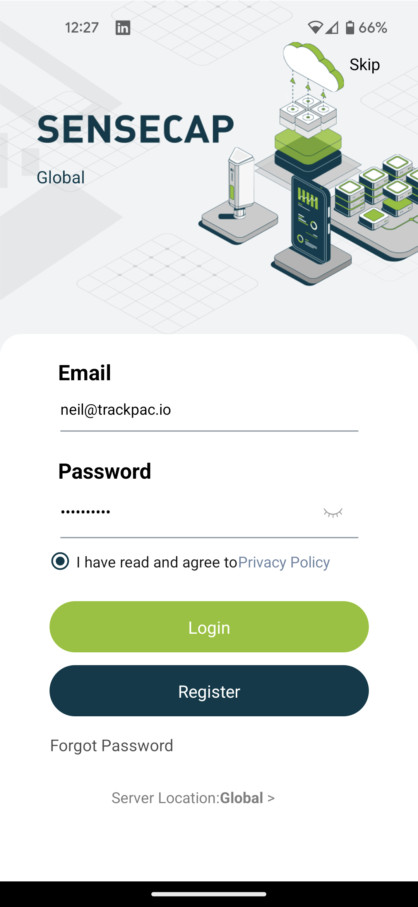
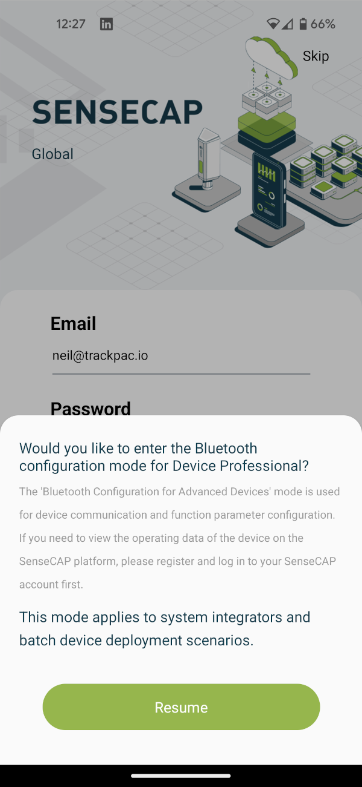
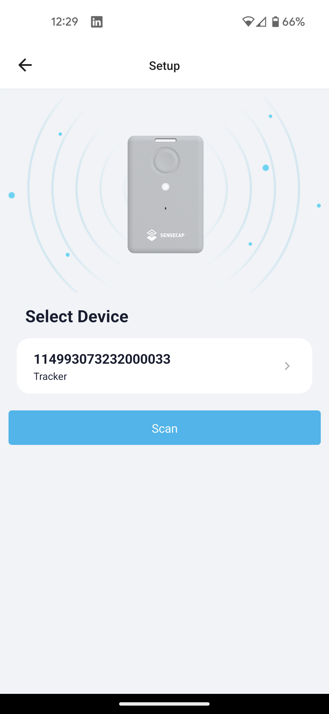
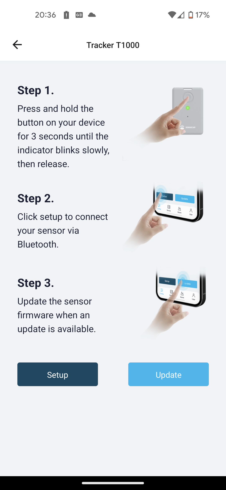
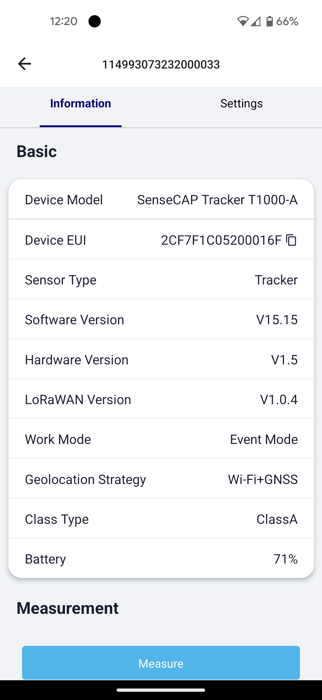
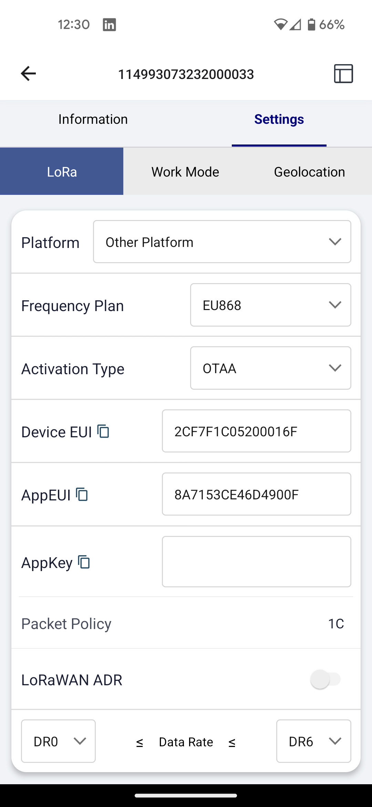
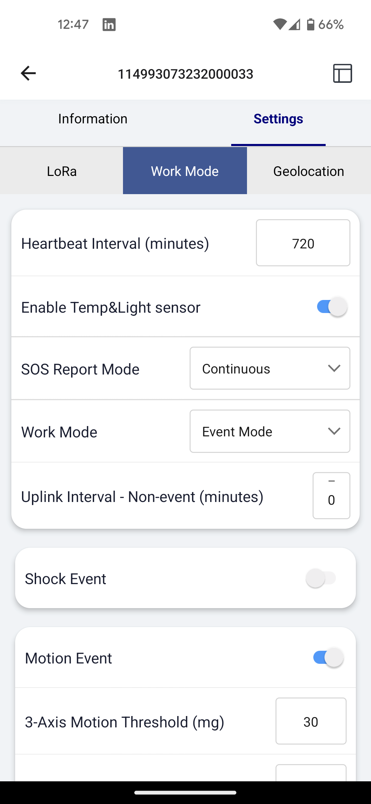
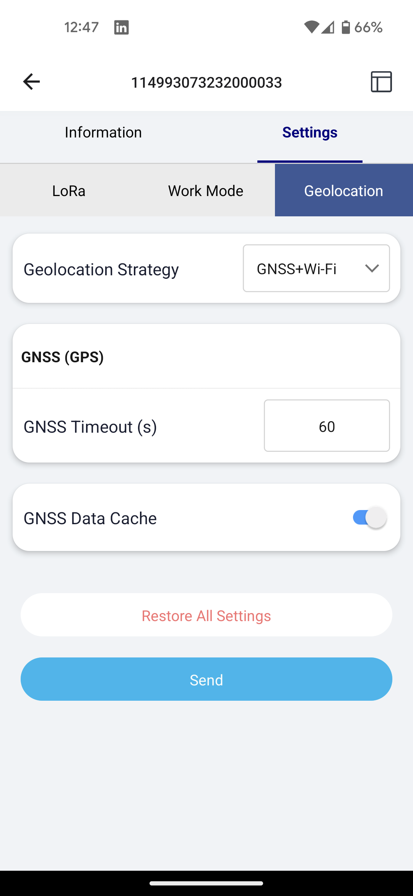

# SenseCAP T1000

Easily integrate your SenseCAP T1000 with Trackpac using this comprehensive guide.

---

## Create or Log In to Your Trackpac Account

### For First-Time Users:

1. Navigate to the Trackpac portal: [https://v2.trackpac.io](https://v2.trackpac.io).
2. You have the option to sign in using social logins, or you can register with a username and password.

---

## Set Up Your Device Using SenseCAP Mate App

1. **Download the App**: Get the [SenseCAP Mate App](https://install.appcenter.ms/orgs/seeed/apps/sensecap-mate/distribution_groups/public) to facilitate the device setup.

2. **Initial Login**: Ignore the login, click skip top right.

3. **Enter Configuration Mode**: A prompt will ask if you wish to enter Bluetooth configuration mode. Click 'Resume' or 'Yes.'

4. **Choose Your Device**: From the list of supported sensors, select 'Tracker T1000.'

5. **Enable Pairing Mode**: Follow the on-screen instructions to enable pairing mode. Hold down the button on your T1000 for 15 seconds until you hear a chime if you haven't turned it on yet.

6. **Scan for Tracker**: Click 'Setup' to initiate a scan for your device. Once found, tap on your device to select it.

7. **View Device Information**: This screen will display details like firmware version. Navigate to the 'Settings' tab at the top right.

8. **Configure for Trackpac**:

   - Change the platform to 'Other Platform.'
   - Note down the `dev_eui` for later use.
   - Update the `APP_EUI` to our recommended value: 545241434B504143 - if you ever want to change it back, a reset will restore the orignal keys
   - Lastly, copy the `app_key`.

   > Note: `dev_eui`, `app_eui`, and `app_key` are essential for adding the device to Trackpac.

9. **Additional Settings**:

   - **Work Mode Tab**: Set the heartbeat interval and enable various sensors and modes. 'Event Mode' is particularly useful, we like to set movement detection and movement ended.

   

   - **Geolocation Tab**: Choose 'WiFi+GNSS' for optimal location tracking in sync with Trackpac’s WiFi location engine, this can extend the battery life of the device.

   

10. **Save Settings**: Click 'Send' at the bottom to save your changes.

---

## Add Your Device to Trackpac

1. **Navigate to Devices**: Open the 'Devices' tab and click the '+' icon at the top-right corner.

   

2. **Choose an Option**:

   - **Scan QR Code**: Scan the QR code on your T1000.
   - **Enter Claim Code**: Manually input the claim code.
   - **Enter Keys Manually**: Use the `dev_eui`, `app_eui`, and `app_key` you noted earlier.
   - **Self-Host**: Set up on your own LoRaWAN server and forward the data to us.

   > For self-hosting, ingest routes can be found [here](https://v2-api.trackpac.io/docs).

**Congratulations!** Your SenseCAP T1000 is now successfully integrated with Trackpac.

---

## Additional Resources

For more details on using your T1000, check out [SenseCAP's User Guide](https://files.seeedstudio.com/products/SenseCAP/SenseCAP_Tracker/SenseCAP_Tracker_T1000-AB_User_Guide.pdf).

---

## Next Steps

- [**Add a Contact**](../getting-started/add-a-contact) - Set up contacts for notifications.
- [**Set Up a Geofence**](../getting-started/add-a-base) - Receive alerts based on device location.

---

Feel free to incorporate this improved guide into your documentation.
