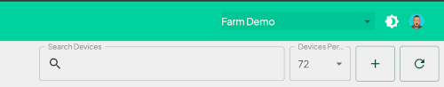
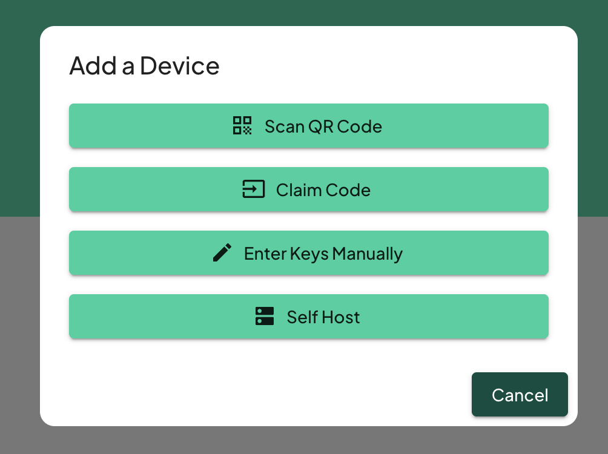

# Add a Device

Once you have created an account and logged in, the next step is adding a device for monitoring.

**Click Add Device'**: Go to the "Devices" tab and click on + Icon top right.

You will then be presented with options as shown below

### Scan a QR Code

Use this option if you have purchased a Trackpac enabled device, you will eithe have a QR code on the device, or one shipped with it. Use your phone's camera to scan the QR code that arrived with your device.

---

### Claim Code

Use this option if you dont have a camera handy to scan the qr, enter the code manually. In the designated field, type the claim code that came with your device.

---

### Enter Keys Manually

This option hosts the device on Trackpac's LNS. you will need the dev_eui, app_eui and app_key to choose this option. Manually enter the device's keys and then select which device type.

---

### Self Host

If you wish to host the device yourself and forward the data to us, this is the option to pick. Choose the option to self-host and follow the guidelines to set up the device on your own LoRaWAN server.

Ingest routes for devices can be found here: https://v2-api.trackpac.io/docs

---

**Congratulations**! You've now successfully signed up and added a device. You're ready to start monitoring.
